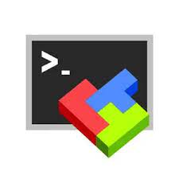

# EkYpe

Our project was to create a web site, which granted acces too multiple information on the Star Wars universe. 
This project was realise during the 48h challenge of our school. 
The project need to have a page that display the information and and an other part that should contain little game.

## fonctuality

#### Responsibility
- The web site need to be responsive
- the web site should be support by any browser
#### Deployement
- The web site need to be host on a serverveur 
- The gitHUb need to automatically update the server when a modification on the main branch is set.
#### API
- Get the information on the SWAPI API
- Create random question with the information of SWAPI (Stars War API)

## Running

To acces the web site you need to go on the address [EkYpe](http://51.83.34.92/)

## techonology
- #### Vue.JS   
- #### MobaXterm   
- #### Figma   
- #### PHP   
- #### Axios   

## Team

- [@Maxime](https://github.com/macsimtv)
- [@Enzo](https://github.com/Ragnarrockk)
- [@Pierric](https://github.com/lancelot260)
- [@Jules](https://github.com/roulios44)
- [@Pierre](https://github.com/BenZitoune)